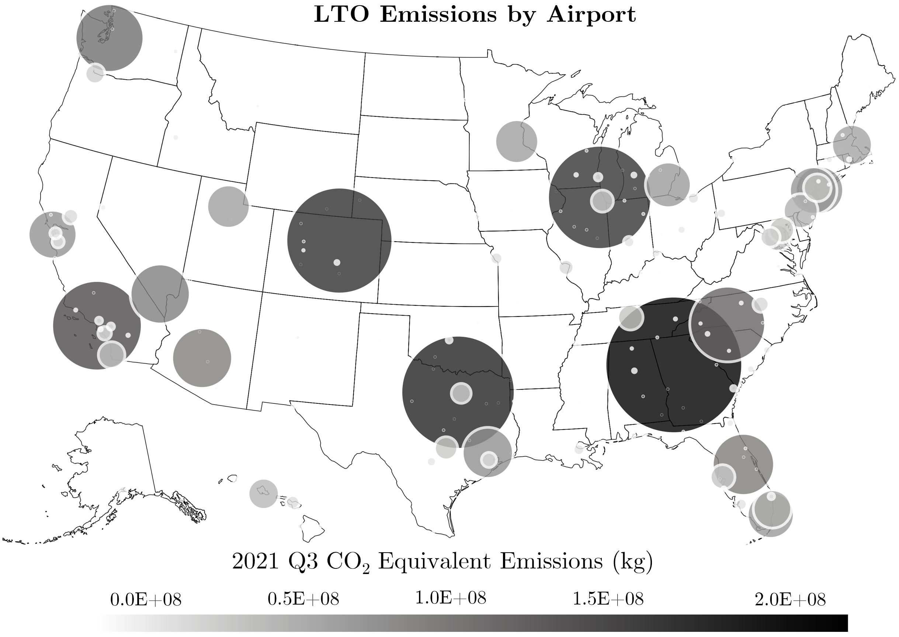
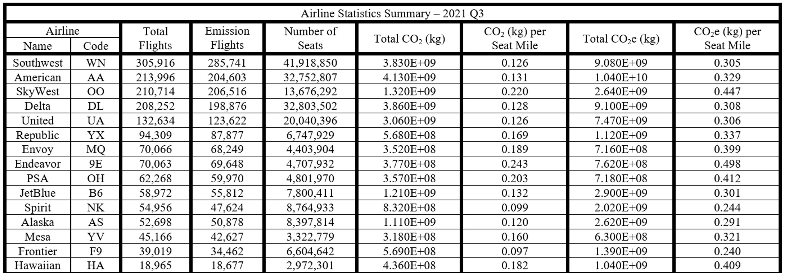
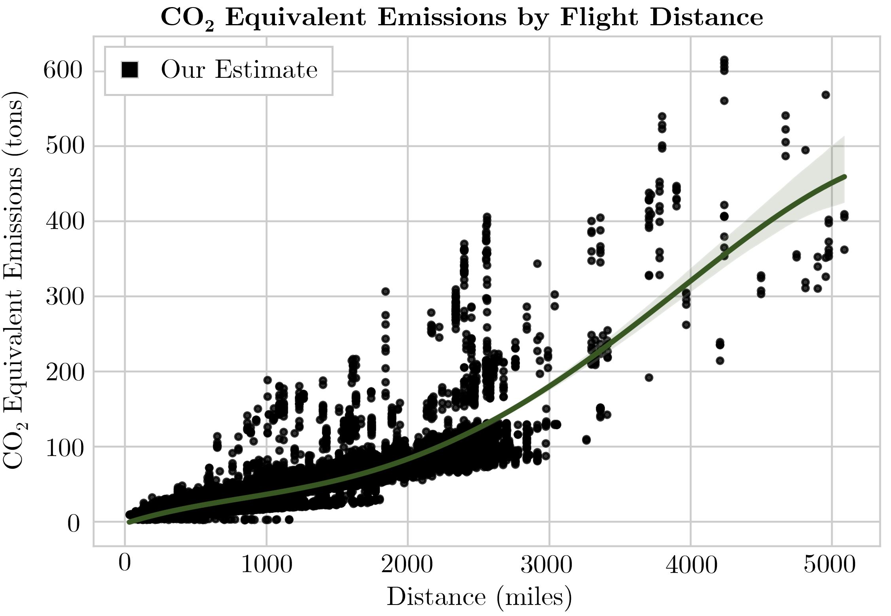

<div id="top"></div>
<div align="center">
  <h1 align="center">Aviation Emissions Calculation</h1>
  
</div>
<!-- TABLE OF CONTENTS -->
<details>
  <summary>Table of Contents</summary>
  <ol>
    <li><a href="#about">About the Project</a></li>
    <li><a href="#usage">Usage</a></li>
    <li><a href="#datasets">Datasets</a></li>
    <li><a href="#results">Results</a></li>
    <li><a href="#license">License</a></li>
    <li><a href="#contact">Contact</a></li>
  </ol>
</details>

<!-- ABOUT -->
## About the Project
Enabled through an aviation emissions estimation tool that is both publicly-accessible and comprehensive, together we can help shape a more sustainable and equitable U.S. air transportation system. This calculator provide emissions estimates for every U.S. domestic flight (as provided by BTS' On-Time data) by matching each airplane's tail number to the equipped engine, which allows us to consider the particular emission factors by time in each stage of flight. Overall, this estimation tool utilizes and integrates six different public datasets provided by the Bureau of Transportation Statistics (BTS), the Federal Aviation Agency (FAA), EUROCONTROL, and the International Civil Aviation Organization (ICAO) to. Additionally, our calculator computes the emissions of four different greenhouse gases (CO2, NOx, CO, HC) during both the LTO and CCD flight cycles. This repository not only contains an easy-to-use Python script to calculate emissions for every domestic flight in a month of your choosing, but also the source Matlab code which contains more in-depth analysis tools. 

<!-- USAGE  -->
## Usage

To run the script, run the below command: 
  ```sh
  python CalculateEmissions.py <YEAR> <MONTH> 
  ```
where &lt;YEAR&gt; and &lt;MONTH&gt; is the period of flights you'd like to calculate emissions for (ex. 2021 1). Note that &lt;MONTH&gt; should be an integer 1-12.
  
<!-- DATASETS -->
## Datasets

#### Aircraft by Airline:
Contains the n-number, airplane type and seating capacity for every registered aircraft in the United States. Source: BTS.

#### Engine Fuel Consumption:
Contains altitude-dependent emissions factors for the CCD stage of flight for 67 different aircraft types. Source: BADA.

#### ICAO Emissions Databank:
Contains emissions factors for the four stages of the LTO stage of flight (Idle, Taxi, Take-off and Approach/Landing) for +800 different engine types. This table also contains the matching between ICAO's engine code and the FAA's engine code. Source: ICAO.

#### LTO Backup: 
Contains a back-up FAA engine code for every unique aircraft type that is utilized whenever there is no matching between a tail-number and an engine type.

#### Master Airplane Engine Table:
Contains the FAA engine code associated with every registered aircraft in the United States. Source: BTS and FAA.

<p align="right">(<a href="#top">back to top</a>)</p>

<!-- Results -->
## Results
<div align="center">
  
  <br />
  Figure 1: Local LTO emissions produced at every airport of the United States during 2021 Q3
  <br />
  <br />
  
  <br />
  Figure 2: Airline Summary Statistics for 2021 Q3 
  <br />
  <br />
  
  <br />
  Figure 3: CO2e emissions against the flight distance for 2021 Q3
</div>
<p align="right">(<a href="#top">back to top</a>)</p>

<!-- LICENSE -->
## License

Distributed under the MIT License. See `LICENSE.txt` for more information.

<p align="right">(<a href="#top">back to top</a>)</p>

<!-- CONTACT -->
## Contact

Created By: [Andy Eskenazi](https://www.linkedin.com/in/andy-eskenazi), [Landon Butler](https://landonbutler.github.io/), [Arnav Joshi](https://www.linkedin.com/in/arnavjoshi64)

<p align="right">(<a href="#top">back to top</a>)</p>

<!-- CITATION -->
## Citation
If you find our tool useful, please cite our [paper]():
  ```sh
  @article{demoAviationEmissionsEst,
title={Democratizing Aviation Emissions Estimation:
Development of an Open-Source, Data-Driven Methodology},
author={Eskenazi, Andy and Butler, Landon and Joshi, Arnav, and Ryerson, Megn},
journal={arXiv preprint arXiv:XXXX.XXXXX},
year={2022}
}
  ```

<p align="right">(<a href="#top">back to top</a>)</p>
